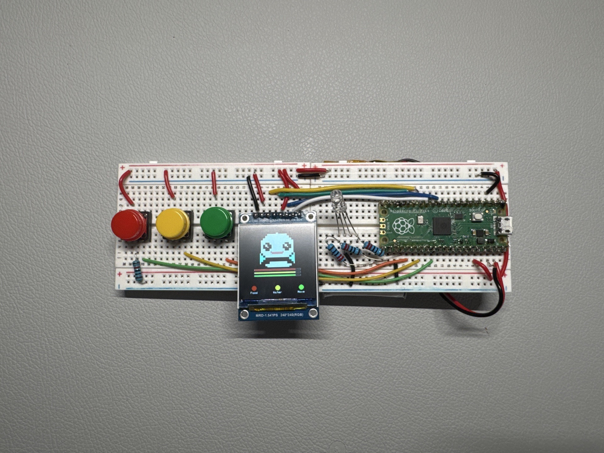
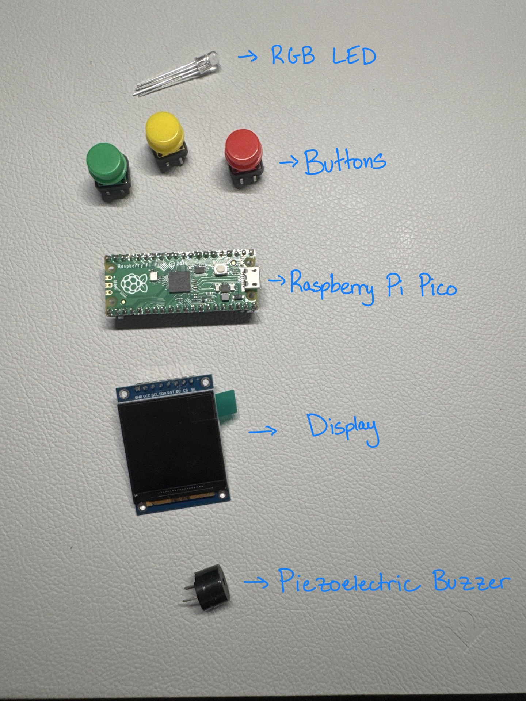

# Build Your Own Virtual Pet

### An Arduino C++ Workshop



---

## What We're Building

A handheld virtual pet that lives on a microcontroller.

- Feed it, water it, play games with it
- Ignore it long enough and it gets hungry and tired
- 3 buttons, an RGB LED, a buzzer, and a screen

**Your pet starts alive but broken — you bring it to life piece by piece.**

---

## What's Inside

<div style="display:flex;gap:28px;align-items:center;margin-top:16px;">
<table style="flex:1;border-collapse:collapse;">
<thead><tr><th style="color:#f0a830;border-bottom:2px solid #f0a830;padding:0.4em 0.8em;font-size:0.75em;text-transform:uppercase;letter-spacing:0.05em;">Component</th><th style="color:#f0a830;border-bottom:2px solid #f0a830;padding:0.4em 0.8em;font-size:0.75em;text-transform:uppercase;letter-spacing:0.05em;">What it does</th></tr></thead>
<tbody>
<tr><td style="padding:0.35em 0.8em;border-bottom:1px solid #2a3545;font-family:'JetBrains Mono',monospace;font-size:0.72em;"><strong>Pico</strong></td><td style="padding:0.35em 0.8em;border-bottom:1px solid #2a3545;font-family:'JetBrains Mono',monospace;font-size:0.72em;">The brain — runs your code</td></tr>
<tr><td style="padding:0.35em 0.8em;border-bottom:1px solid #2a3545;font-family:'JetBrains Mono',monospace;font-size:0.72em;"><strong>LCD Display</strong></td><td style="padding:0.35em 0.8em;border-bottom:1px solid #2a3545;font-family:'JetBrains Mono',monospace;font-size:0.72em;">Shows your pet's face and stats</td></tr>
<tr><td style="padding:0.35em 0.8em;border-bottom:1px solid #2a3545;font-family:'JetBrains Mono',monospace;font-size:0.72em;"><strong>3 Buttons</strong></td><td style="padding:0.35em 0.8em;border-bottom:1px solid #2a3545;font-family:'JetBrains Mono',monospace;font-size:0.72em;">Red, Yellow, Green — your controls</td></tr>
<tr><td style="padding:0.35em 0.8em;border-bottom:1px solid #2a3545;font-family:'JetBrains Mono',monospace;font-size:0.72em;"><strong>RGB LED</strong></td><td style="padding:0.35em 0.8em;border-bottom:1px solid #2a3545;font-family:'JetBrains Mono',monospace;font-size:0.72em;">Mood indicator + game feedback</td></tr>
<tr><td style="padding:0.35em 0.8em;font-family:'JetBrains Mono',monospace;font-size:0.72em;"><strong>Buzzer</strong></td><td style="padding:0.35em 0.8em;font-family:'JetBrains Mono',monospace;font-size:0.72em;">Sound effects and melodies</td></tr>
</tbody>
</table>

</div>

---

## Setup

Five steps. Then you're coding.

----

### 1 — Install VS Code

<div class="step-num">01</div>

Download from **code.visualstudio.com**

- Choose Windows, Mac, or Linux
- Run the installer — accept the defaults
- Open VS Code when done

<div style="border: 3px dashed #bd93f9; border-radius: 12px; padding: 15px; margin-top: 20px; text-align: center; color: #bd93f9; font-size: 0.5em;">
📷 PHOTO: VS Code download page — arrow on the big blue Download button
</div>

----

### 2 — Install PlatformIO

<div class="step-num">02</div>

Open the **Extensions** panel:

- **Windows / Linux** — `Ctrl+Shift+X`
- **Mac** — `Cmd+Shift+X`
- Search **PlatformIO IDE**, click **Install**
- VS Code reloads automatically

<div style="border: 3px dashed #bd93f9; border-radius: 12px; padding: 15px; margin-top: 20px; text-align: center; color: #bd93f9; font-size: 0.5em;">
📷 PHOTO: VS Code Extensions panel — "PlatformIO IDE" result with Install button highlighted
</div>

----

### 3 — Get the Project

<div class="step-num">03</div>

```
git clone https://github.com/guywithhat99/tamagotchi_starter
```

No git? Open **github.com/guywithhat99/tamagotchi_starter**, click **Code → Download ZIP**, extract it somewhere you'll find again.

<div style="border: 3px dashed #bd93f9; border-radius: 12px; padding: 15px; margin-top: 20px; text-align: center; color: #bd93f9; font-size: 0.5em;">
📷 PHOTO: GitHub repo page — green Code button and Download ZIP option highlighted
</div>

----

### 4 — Open the Folder

<div class="step-num">04</div>

- **File → Open Folder** in VS Code
- Select the `tamagotchi_starter` folder
- PlatformIO detects `platformio.ini` automatically
- **First open downloads the Pico toolchain** — watch the status bar at the bottom

<div style="border: 3px dashed #bd93f9; border-radius: 12px; padding: 15px; margin-top: 20px; text-align: center; color: #bd93f9; font-size: 0.5em;">
📷 PHOTO: VS Code with tamagotchi_starter open — PlatformIO loading indicator in the bottom status bar
</div>

----

### 5 — Build & Upload

<div class="step-num">05</div>

PlatformIO adds its own icons to the **bottom toolbar**:

- Click **✓** — wait for **SUCCESS** in the terminal
- Plug your Pico in via USB
- Click **→** to upload

<div style="border: 3px dashed #50fa7b; border-radius: 12px; padding: 15px; margin-top: 20px; text-align: center; color: #50fa7b; font-size: 0.5em;">
📷 PHOTO: VS Code bottom toolbar — ✓ Build and → Upload buttons labelled
</div>

----

### platformio.ini — What's Inside

```ini
[env:rpipico]
platform          = https://github.com/maxgerhardt/platform-raspberrypi.git
board             = rpipico
framework         = arduino
board_build.core  = earlephilhower

lib_deps =
    adafruit/Adafruit ST7735 and ST7789 Library
    adafruit/Adafruit GFX Library
```

Already in the project — PlatformIO reads this and installs everything.

---

## The Pico

<div style="border: 3px dashed #bd93f9; border-radius: 12px; padding: 20px; margin-top: 16px; text-align: center; color: #bd93f9; font-size: 0.5em; min-height: 460px; display: flex; align-items: center; justify-content: center;">
📷 PHOTO: Pico pinout — all GPIO pins labelled
</div>

----

### setup() and loop()

Every Arduino program has two functions:

```cpp
void setup() {
    // runs ONCE at power-on
}

void loop() {
    // runs FOREVER, as fast as possible
}
```

This is the heartbeat of every embedded program.

---

## Wiring — Display

SPI protocol — 6 data wires + power.

<table style="width:70%; margin: 0 auto;">
<thead><tr><th>Signal</th><th>Pico Pin</th><th></th><th>Signal</th><th>Pico Pin</th></tr></thead>
<tbody>
<tr><td>SCK</td><td>GP10</td><td style="border:none;"></td><td>RST</td><td>GP12</td></tr>
<tr><td>MOSI</td><td>GP11</td><td style="border:none;"></td><td>BL</td><td>GP13</td></tr>
<tr><td>DC</td><td>GP8</td><td style="border:none;"></td><td>VCC</td><td>3V3</td></tr>
<tr><td>CS</td><td>GP9</td><td style="border:none;"></td><td>GND</td><td>GND</td></tr>
</tbody>
</table>

<div style="border: 3px dashed #bd93f9; border-radius: 12px; padding: 15px; margin-top: 20px; text-align: center; color: #bd93f9; font-size: 0.5em;">
📷 PHOTO: Display wired to Pico on breadboard — trace each wire from display pin to Pico pin
</div>

----

### Wiring — Buttons

Each button: one leg to GPIO, other leg to GND.

| Button | Pico Pin |
|--------|----------|
| Red | GP22 |
| Yellow | GP21 |
| Green | GP19 |

<div style="border: 3px dashed #bd93f9; border-radius: 12px; padding: 15px; margin-top: 20px; text-align: center; color: #bd93f9; font-size: 0.5em;">
📷 PHOTO: Close-up of 3 buttons on breadboard — colour-coded jumper wires to Pico pins and GND rail
</div>

----

### Wiring — LED & Buzzer

**RGB LED:** Red→GP16, Green→GP17, Blue→GP18, GND→GND

**Buzzer:** +→GP6, -→GND

<div style="border: 3px dashed #bd93f9; border-radius: 12px; padding: 15px; margin-top: 20px; text-align: center; color: #bd93f9; font-size: 0.5em;">
📷 PHOTO: LED and buzzer wired on breadboard — show LED leg order (longest leg = common cathode → GND)
</div>

---

## Step 0 — Hello World

Get the display working.

----

### main.cpp

Create `src/main.cpp`:

```cpp
#include <Arduino.h>
#include "Pet.h"

Pet pet;

void setup() {
    Serial.begin(115200);
    Serial.println("Pet alive!");
    pet.begin();
}

void loop() {
    pet.update();
    delay(50);
}
```

`Pet` is provided — it handles the display, stats, and sprites.

----

### Serial Monitor

Open the Serial Monitor (**PlatformIO sidebar → Serial Monitor**, or the plug icon).

`Serial.begin(115200)` opens a connection at 115200 baud.
`Serial.println()` sends a line of text to your computer.

```
Pet alive!
```

This is your **debugging window** — you'll use it throughout the workshop to see what your code is doing.

----

### Try It

Upload — your pet's face appears and "Pet alive!" shows in the Serial Monitor.

**Nothing in the monitor?** Make sure baud rate is set to **115200** in the Serial Monitor dropdown.

----

### ✓ What You Learned

- Your program has `setup()` — runs once — and `loop()` — runs forever
- `Serial.begin(115200)` opens USB serial at 115200 baud — same cable as upload, no extra wiring
- `Serial.println()` sends text to your computer — your first debugging tool
- `pet.begin()` initialises the display and draws the pet's face
- `pet.update()` redraws the screen each frame

---

## Step 1 — Buttons

Teach your pet to listen.

----

### How Buttons Work

`digitalRead(pin)` returns `HIGH` or `LOW`.

**Edge detection** — react to a *press*, not a *hold*:

```cpp
static bool lastRed = false;
bool red = digitalRead(22);

if (red && !lastRed) {
    // fresh press — fire once!
}

lastRed = red;
```

`static` keeps `lastRed` alive between calls.

----

### buttons.h

```cpp
#pragma once
#include "Pet.h"

void setupButtons();
void readButtons(Pet& pet);
```

`.h` declares. `.cpp` defines.

----

### buttons.cpp — setup

```cpp
#include <Arduino.h>
#include "buttons.h"

const int PIN_BTN_RED    = 22;
const int PIN_BTN_YELLOW = 21;
const int PIN_BTN_GREEN  = 19;

static bool lastRed    = false;
static bool lastYellow = false;
static bool lastGreen  = false;

void setupButtons() {
    pinMode(PIN_BTN_RED,    INPUT_PULLDOWN);
    pinMode(PIN_BTN_YELLOW, INPUT_PULLDOWN);
    pinMode(PIN_BTN_GREEN,  INPUT_PULLDOWN);
}
```

----

### buttons.cpp — readButtons

```cpp
void readButtons(Pet& pet) {
    bool red    = digitalRead(PIN_BTN_RED);
    bool yellow = digitalRead(PIN_BTN_YELLOW);
    bool green  = digitalRead(PIN_BTN_GREEN);

    if (red    && !lastRed)    pet.feed();
    if (yellow && !lastYellow) pet.drink();
    if (green  && !lastGreen)  pet.say(pet.catchphrase());

    lastRed    = red;
    lastYellow = yellow;
    lastGreen  = green;
}
```

----

### Update main.cpp

```cpp
#include <Arduino.h>
#include "Pet.h"
#include "buttons.h"

Pet pet;

void setup() {
    Serial.begin(115200);
    pet.begin();
    setupButtons();
}

void loop() {
    readButtons(pet);
    pet.update();
    delay(50);
}
```

----

### Try It

- **Red** — feed your pet ("Yum!", "So full!")
- **Yellow** — give it water ("Refreshing!")
- **Green** — hear its catchphrase

<div style="border: 3px dashed #50fa7b; border-radius: 12px; padding: 20px; margin-top: 15px; text-align: center; color: #50fa7b; font-size: 0.5em;">
📷 PHOTO: Display showing "Yum!" or "So full!" after pressing red button
</div>

Buttons firing randomly? You forgot `INPUT_PULLDOWN`.

----

### ✓ What You Learned

- `digitalRead()` returns HIGH or LOW — the two states of a digital signal
- `INPUT_PULLDOWN` keeps the pin LOW when the button isn't pressed
- Edge detection: compare *current* state to *last* state to fire exactly once per press
- Header/source split: `.h` is the interface, `.cpp` is the implementation

---

## Step 2 — Sound

Give your pet a voice.

<div style="border: 3px dashed #bd93f9; border-radius: 12px; padding: 15px; margin-top: 20px; text-align: center; color: #bd93f9; font-size: 0.5em;">
📷 PHOTO: Close-up of the buzzer on the breadboard
</div>

----

### tone()

```cpp
tone(pin, frequency, duration);
```

Frequency = pitch. Higher = higher note.

| Note | Hz | Note | Hz |
|------|----|------|----|
| C5 | 523 | G5 | 784 |
| D5 | 587 | A5 | 880 |
| E5 | 659 | B5 | 988 |

A melody is an array of `{freq, duration}` pairs.

----

### sound.h

```cpp
#pragma once
#include "Pet.h"

void setupBuzzer();
void playTone(int freq, int duration);
void playMelody(const int notes[][2], int len);
void chirp(Mood m);
```

----

### sound.cpp — playTone

```cpp
const int PIN_BUZZER = 6;

void setupBuzzer() {
    pinMode(PIN_BUZZER, OUTPUT);
}

void playTone(int freq, int duration) {
    if (freq > 0) {
        tone(PIN_BUZZER, freq, duration);
        delay(duration);
        noTone(PIN_BUZZER);
    } else {
        delay(duration);
    }
}
```

----

### sound.cpp — chirp

```cpp
void chirp(Mood m) {
    switch (m) {
        case Mood::HAPPY:
            playTone(880, 80);
            playTone(988, 80);
            break;
        case Mood::SAD:
            playTone(330, 200);
            playTone(262, 300);
            break;
        default:
            playTone(523, 100);
            break;
    }
}
```

Happy = bright rising chirp. Sad = low falling moan.

----

### Try It

Add `#include "sound.h"` and `setupBuzzer()` to `main.cpp`.

Add `chirp(pet.mood())` after each button action in `buttons.cpp`.

Every press now makes a sound that matches your pet's mood.

**Change the frequencies** — what does 1400 Hz sound like?

----

### ✓ What You Learned

- `tone(pin, freq, ms)` generates a square wave — the simplest form of digital audio
- Frequency maps directly to musical pitch: 440 Hz = A4, double it for the octave above
- A melody is just data: an array of `{frequency, duration}` pairs iterated in a loop
- `switch` on an enum is a clean way to branch on a fixed set of states

---

## Step 3 — LEDs

Light it up.

----

### RGB Colour Mixing

One LED, three channels. Mix them digitally:

```
(1, 0, 0) = Red       (1, 1, 0) = Yellow
(0, 1, 0) = Green     (1, 0, 1) = Magenta
(0, 0, 1) = Blue      (1, 1, 1) = White
```

<div style="border: 3px dashed #50fa7b; border-radius: 12px; padding: 20px; margin-top: 15px; text-align: center; color: #50fa7b; font-size: 0.5em;">
📷 PHOTO: Grid showing the LED in each colour — red, green, blue, yellow, magenta, white
</div>

----

### leds.h + leds.cpp

```cpp
// leds.h
#pragma once
void setupLeds();
void setLed(int r, int g, int b);
int playSimon();
```

```cpp
void setupLeds() {
    pinMode(PIN_LED_R, OUTPUT);
    pinMode(PIN_LED_G, OUTPUT);
    pinMode(PIN_LED_B, OUTPUT);
}

void setLed(int r, int g, int b) {
    digitalWrite(PIN_LED_R, r);
    digitalWrite(PIN_LED_G, g);
    digitalWrite(PIN_LED_B, b);
}
```

----

### Simon Says

Provided code — copy `playSimon()` into `leds.cpp`.

It uses YOUR `setLed()` and `playTone()` to:
1. Flash a colour sequence with tones
2. Wait for matching button presses
3. Win = white flash + victory tune. Lose = fail buzz.

Wire yellow button → `playSimon()` in `buttons.cpp`.

----

### Mood LED Glow

Add to `buttons.cpp` — after any press, glow the pet's mood:

```cpp
switch (pet.mood()) {
    case Mood::HAPPY: setLed(0, 1, 0); break;
    case Mood::SAD:   setLed(1, 0, 0); break;
    case Mood::DEAD:  setLed(0, 0, 0); break;
    default:          setLed(1, 1, 0); break;
}
```

----

### Try It

- Press any button — LED glows mood colour
- Press yellow — Simon Says starts
- Beat Simon = pet gets fed + victory fanfare

<div style="border: 3px dashed #50fa7b; border-radius: 12px; padding: 15px; margin-top: 10px; text-align: center; color: #50fa7b; font-size: 0.5em;">
📷 PHOTO: LED glowing green (happy pet) after feeding. Bonus: show red glow when stats are low.
</div>

Wrong colours? Check pin wiring — GP16=R, GP17=G, GP18=B.

----

### ✓ What You Learned

- `digitalWrite()` drives an output pin HIGH or LOW — the foundation of hardware control
- An RGB LED is three separate LEDs sharing a common cathode — you control each channel independently
- Reading code you didn't write is a core skill: `playSimon()` uses your `setLed()` and `playTone()` functions
- Physical feedback (light, sound together) makes interactions feel real

---

## Step 4 — Alive!

Your pet has needs now.

----

### millis() — Time Without Blocking

`delay()` freezes everything. `millis()` doesn't:

```cpp
uint32_t start = millis();

while (millis() - start < 3000) {
    // runs for 3 seconds
    // nothing else is frozen
}
```

`uint32_t` because `millis()` returns an unsigned 32-bit value.

----

### game.h + game.cpp

```cpp
// game.h
#pragma once
#include <stdint.h>

int32_t buttonMash(int32_t pin, uint32_t durationMs);
```

```cpp
int32_t buttonMash(int32_t pin, uint32_t durationMs) {
    int32_t  presses = 0;
    bool     lastBtn = digitalRead(pin);
    uint32_t start   = millis();

    while (millis() - start < durationMs) {
        bool btn = digitalRead(pin);
        if (btn && !lastBtn) presses++;
        lastBtn = btn;
        delay(10);
    }
    return presses;
}
```

----

### The Final main.cpp

```cpp
#include <Arduino.h>
#include "Pet.h"
#include "buttons.h"
#include "sound.h"
#include "leds.h"
#include "game.h"

Pet pet;

void setup() {
    Serial.begin(115200);
    Serial.println("Pet alive!");
    pet.begin();
    setupButtons();
    setupBuzzer();
    setupLeds();
    pet.enableDecay();
}
```

`enableDecay()` starts the clock. Stats drop. Your pet is mortal.

----

### loop() — Green Button Mash

```cpp
void loop() {
    static bool lastGreen = false;
    bool green = digitalRead(19);

    if (green && !lastGreen) {
        pet.say("MASH IT!");
        int32_t presses = buttonMash(19, 3000);
        pet.exercise(presses);
    }

    lastGreen = green;
    readButtons(pet);
    pet.update();
    delay(50);
}
```

----

### Try It

- Leave it for 30 seconds — watch the stat bars drop
- LED flashes red when stats get low
- Press green — "MASH IT!" — hit it as fast as you can for 3 seconds
- Feed and water it to keep the stats up

<div style="border: 3px dashed #50fa7b; border-radius: 12px; padding: 20px; margin-top: 15px; text-align: center; color: #50fa7b; font-size: 0.5em;">
📷 PHOTO: Display showing sad pet with low stat bars, red LED glowing
</div>

----

### ✓ What You Learned

- `millis()` gives you time without blocking — essential for any responsive embedded program
- `uint32_t` vs `unsigned long`: explicit width types are portable and self-documenting
- `enableDecay()` turns your program into a real-time system — stats change even when you do nothing
- Counting button presses over a time window is a simple but effective game mechanic

---

## Step 5 — Make It Yours

----

### Tune Your Pet

```cpp
PetConfig config;

config.decayRate      = 3;
config.decayInterval  = 5000;
config.feedAmount     = 10;

pet.begin(config);
```

Lower `decayInterval` = harder. Higher `feedAmount` = easier.

----

### What Now?

You know how to wire hardware, read inputs, drive outputs, and structure C++ across multiple files.

Take what you built and make something new.

A reaction timer. A night light. A noise machine. A door alarm. A two-player game.

**The circuit is yours — you choose what it does next.**

---

## What You Built

- `pinMode` / `digitalRead` / `digitalWrite` — the three verbs of GPIO
- `tone()` — PWM audio: frequency is pitch, duration is rhythm
- RGB colour mixing with `digitalWrite` on three channels
- `millis()` — non-blocking time: the foundation of real-time embedded logic
- Header/source split in C++ — interface vs implementation
- Edge detection — the pattern behind every button in every device

You built a complete interactive embedded device from scratch.

----

### What's Next?

- **WiFi** — Pico W has wireless built in. Connect your pet online.
- **Sensors** — temperature, light, accelerometer — new inputs, same patterns.
- **Multiplayer** — two Picos talking over serial or WiFi.
- **Custom sprites** — draw at piskelapp.com, convert with the included tool.

Take it home.
